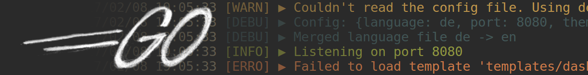

# Logo


A simple logging library for golang.



I wanted to have a logger that is easy configurable with various `io.Writers` and a simple active and color on / off switch, so I created it.

[](https://travis-ci.org/mbndr/logo)
[](https://goreportcard.com/report/github.com/mbndr/logo)
[](https://gocover.io/github.com/mbndr/logo)
[](https://godoc.org/github.com/mbndr/logo)
[](https://github.com/mbndr/logo/blob/master/LICENSE)

## Explanation
A `Logger` object can hold multiple `Receivers`. Every `Receiver` holds an `io.Writer` object (f.e. `os.File`, `os.Stderr`), a `Level` which is minimal the log level that is logged, a boolean `Active` which says if the `Receiver` should log or not, and a boolean `Color` which prints output colored if turned on. Every `Receiver` has also its own log format.

## Initilization

First you have to install the package.
```
go get -u github.com/mbndr/logo
```
After that you can import it.
```go
import "github.com/mbndr/logo"
```

### Simple
It's possible to create a simple logger with a `io.Writer`, the log level and a color boolean as parameter.
```go
// Create a simple cli logger with activated colors which logs everything
log := logo.NewSimpleLogger(os.Stderr, logo.DEBUG, "prefix ", true)
```

### Advanced
You can create multiple `Receivers` and add it to a new `Logger`.
```go
// Receiver for the terminal which logs everything
cliRec := logo.NewReceiver(os.Stderr, "prefix ")
cliRec.Color = true
cliRec.Level = logo.DEBUG

// Helper function to get a os.File with the correct options
logFile, _ := logo.Open("./example/logo.log")

// Receiver for the log file
// This will log with level INFO (default) and have no colors activated
// Also the log format is simpler (f.e. ERRO: Message)
fileRec := logo.NewReceiver(logFile, "prefix ")
fileRec.Format = "%s: %s"

// Create the logger
log := logo.NewLogger(cliRec, fileRec)
```

## Usage
If you created you `logo.Logger` object, there are a few methods you can use to log.
```go
// Methods which write like log.Println()
log.Debug("First debug", " and another string to log")
log.Info("Information")
log.Warn("Warning", " message")
log.Error("Error message")
log.Fatal("Fatal error", " because of something")

// Methods which write like log.Printf()
log.Debugf("Debug value %d", 16)
log.Infof("Listening on port %d", 8080)
log.Warnf("Invalid user %s", user.Name)
log.Errorf("Couldn't load config file: %s", path)
log.Fatalf("Fatal error: %s", err.Error())

// Disable the logger
log.Active = false
```

## Tests
There are a few unit tests written for this library. To run them `cd` into the project directory and run this.
```
go test -v
```
